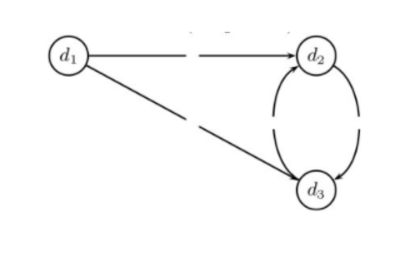
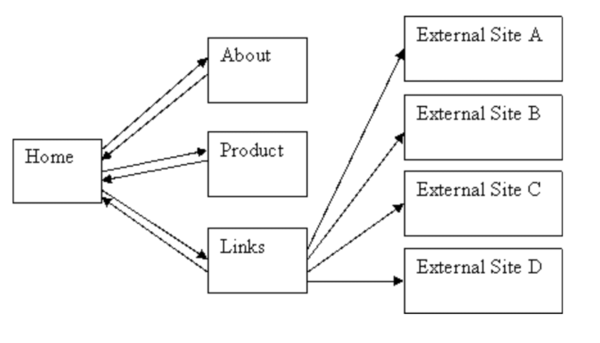

# Задание 8 от 05.10.20 (Анализ ссылок)

Валентин Александров, 620 группа

## Постановка задачи

Дан веб-граф, составить матрицу переходов
Коэффициент телепортации $p=0.1$
Составить матрицу переходов и вычислить pagerank для узлов сети.
Начальный вектор состояний можно взять с равными вероятностями для каждого состояния.

## Решение

Код для вычисления стационарного распределения:

```python
def get_stationary_distribution(P, d_initial=None, eps=1e-6):
    if d_initial is None:
        d_initial = np.ones((P.shape[0])) / P.shape[0]
    d = d_initial
    d_next = d@P
    diff = np.abs(d - d_next).mean()
    while diff > eps:
        d = d_next
        d_next = d@P
        diff = np.abs(d - d_next).mean()
        print(f'{diff:.8f}')
    return d_next
```

### Задание 1



Матрица переходов:

|    | d1   | d2   | d3   |
|----|------|------|------|
| d1 | 0.03 | 0.48 | 0.48 |
| d2 | 0.03 | 0.03 | 0.93 |
| d3 | 0.03 | 0.93 | 0.03 |

Значения PageRank:

|          | d1    | d2    | d3    |
|----------|-------|-------|-------|
| PageRank | 0.033 | 0.483 | 0.483 |

### Задание 2



Матрица переходов:

|         | Home   | About  | Product | Links  | A      | B      | C      | D      |
|---------|--------|--------|---------|--------|--------|--------|--------|--------|
| Home    | 0.0125 | 0.3125 | 0.3125  | 0.3125 | 0.0125 | 0.0125 | 0.0125 | 0.0125 |
| About   | 0.9125 | 0.0125 | 0.0125  | 0.0125 | 0.0125 | 0.0125 | 0.0125 | 0.0125 |
| Product | 0.9125 | 0.0125 | 0.0125  | 0.0125 | 0.0125 | 0.0125 | 0.0125 | 0.0125 |
| Links   | 0.1925 | 0.0125 | 0.0125  | 0.0125 | 0.1925 | 0.1925 | 0.1925 | 0.1925 |
| A       | 0.125  | 0.125  | 0.125   | 0.125  | 0.125  | 0.125  | 0.125  | 0.125  |
| B       | 0.125  | 0.125  | 0.125   | 0.125  | 0.125  | 0.125  | 0.125  | 0.125  |
| C       | 0.125  | 0.125  | 0.125   | 0.125  | 0.125  | 0.125  | 0.125  | 0.125  |
| D       | 0.125  | 0.125  | 0.125   | 0.125  | 0.125  | 0.125  | 0.125  | 0.125  |

Значения PageRank:

|          | Home   | About  | Product | Links  | A      | B      | C      | D      |
|----------|--------|--------|---------|--------|--------|--------|--------|--------|
| PageRank | 0.3156 | 0.1377 | 0.1377  | 0.1377 | 0.0677 | 0.0677 | 0.0677 | 0.0677 |
